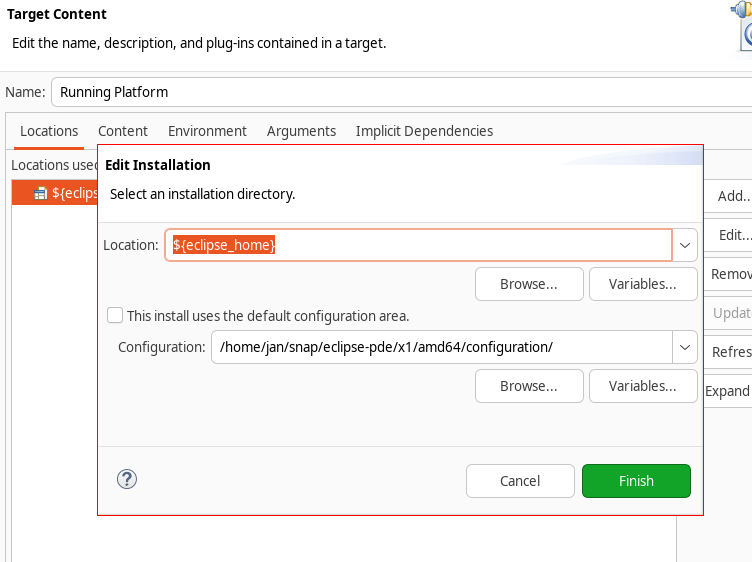
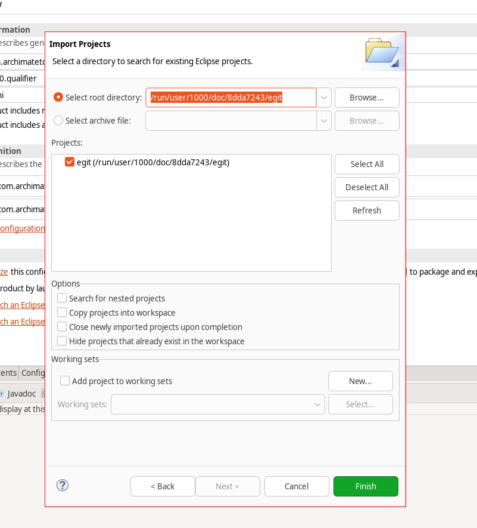
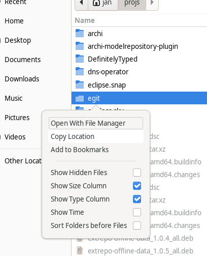

# Eclipse (Unofficial snap distribution of eclipse-*)

Ships a little altered approach

* flavored eclipse - any eclipse-package can be snapped
* goes along a latest snap confinement.
Selected touchpoints with the home-directory remain.

Attempt to merge with other eclipse snaps

* <https://github.com/snapcrafters/eclipse/pull/56>
* <https://github.com/eclipse-linuxtools/eclipse-ide-snap/issues/9>

## Wanna try?

1. `git clone https://github.com/janesser/eclipse-snap.git`
2. edit `eclipse-packages.yaml` according to your needs, and what is available at <www.eclipse.org/download> (see comment on query-params tweaking)
3. `./try-build.sh eclipse-pde` other packages declared will work

### Hacks included

the snap shares following pathes with the users $HOME (accessible from both ends)
(personal-files interface restricts file-access to 'rw')

* `$HOME/.m2` maven-cached files are shared (may contain maven secrets eventually)
* `$HOME/.gitconfig` share git user settings
* `$HOME/.ssh` share ssh-keys and cares about known_hosts fingerprints

Once you assured that these locations are okay to be connected to the confined eclipse, use below script.

```bash
export ECLIPSE_PACKAGE=janesser-eclipse-pde

sudo snap connect $ECLIPSE_PACKAGE:dot-gitconfig
sudo snap connect $ECLIPSE_PACKAGE:dot-m2
sudo snap connect $ECLIPSE_PACKAGE:ssh-keys
```

### Troubleshoot

* Eclipse may or may not (depending on its configuration) be prepared to run in such a limited setup.
* Some findings occur even in non-confined eclipse installations.

### Known issues

* something is broken with certain GPU setups <https://github.com/canonical/gpu-snap/issues/27>

* snapcraft times out

  SOLUTION: restart lxd daemon
  
  ```bash
  # when build timeouts
  sudo systemctl restart snap.lxd.daemon
  ```

* p2 install fails

  SOLUTION: double-check `eclipse.ini` in regards of `eclipse.home.location` and `eclipse.p2.data.area`
  (both get preset by snap/local/wrappers/eclipse)

  ```text
  An error occurred while collecting items to be installed
    session context was:(profile=epp.package.committers, phase=org.eclipse.equinox.internal.p2.engine.phases.Collect, operand=, action=).
    Can't download artifact osgi.bundle,org.eclipse.emf.compare,3.5.3.202406060900 required by org.eclipse.emf.compare[3.5.3.202406060900], 
    ...
    from any of the following repositories: 
      file:/snap/eclipse-pde/x1/
      file:/home/jan/snap/eclipse-pde/x1/amd64/p2/org.eclipse.equinox.p2.core/cache/
      file:/home/jan/snap/eclipse-pde/x2/amd64/p2/org.eclipse.equinox.p2.core/cache/
      file:/snap/eclipse-pde/x1/.eclipseextension
      file:/home/jan/snap/eclipse-pde/x2/amd64/configuration/org.eclipse.osgi/229/data/listener_1925729951/
      file:/home/jan/snap/eclipse-pde/x1/amd64/
      file:/home/jan/snap/eclipse-pde/x1/amd64/configuration/org.eclipse.osgi/229/data/listener_1925729951/
      file:/snap/eclipse-pde/x2/.eclipseextension
      https://download.eclipse.org/eclipse/updates/4.33
      https://download.eclipse.org/tools/orbit/simrel/orbit-aggregation/release/4.33.0
      https://download.eclipse.org/lsp4e/releases/0.26.6
      https://download.eclipse.org/webtools/downloads/drops/R3.35.0/R-3.35.0-20240825085431/repository
      https://download.eclipse.org/justj/epp/release/21.0.0.v20241024-0603
      https://download.eclipse.org/egit/updates-7.1
      https://download.eclipse.org/wildwebdeveloper/releases/1.3.9
      https://download.eclipse.org/mylyn/updates/release/4.5.0
      https://download.eclipse.org/lsp4j/updates/releases/0.23.1
      https://download.eclipse.org/technology/m2e/releases/latest
      https://download.eclipse.org/releases/2024-12
      https://download.eclipse.org/technology/epp/packages/latest/
      https://download.eclipse.org/releases/latest
      https://download.eclipse.org/eclipse/updates/4.34
      https://download.eclipse.org/justj/epp/release/latest
      https://download.eclipse.org/tm4e/releases/0.14.0
      https://download.eclipse.org/modeling/emf/emf/builds/release/2.40.0
      https://download.eclipse.org/justj/jres/21/updates/release/latest
  ```

* pde product can't load libswt

  SOLUTION: move configuration to a locatioan where libswt may be loaded with 'x' (which could be $SNAP_USER_DATA), but not any of personal-files-interface locations.

  <https://github.com/eclipse-platform/eclipse.platform.swt/issues/1669>

  ```text
  java.lang.UnsatisfiedLinkError: Could not load SWT library. Reasons: 
    /home/jan/eclipse-workspace/.metadata/.plugins/org.eclipse.pde.core/archi.product/org.eclipse.osgi/182/0/.cp/libswt-gtk-4967r8.so: /home/jan/eclipse-workspace/.metadata/.plugins/org.eclipse.pde.core/archi.product/org.eclipse.osgi/182/0/.cp/libswt-gtk-4967r8.so: failed to map segment from shared object
    no swt-gtk in java.library.path: /var/lib/snapd/lib/gl:/var/lib/snapd/lib/gl32:/var/lib/snapd/void:/snap/eclipse-pde/x8/usr/lib:/snap/eclipse-pde/x8/usr/lib/x86_64-linux-gnu:/snap/eclipse-pde/x8/gpu-2404/usr/lib/x86_64-linux-gnu:/snap/eclipse-pde/x8/gpu-2404/usr/lib/x86_64-linux-gnu/vdpau:/snap/eclipse-pde/x8/gpu-2404/usr/lib/i386-linux-gnu:/snap/eclipse-pde/x8/gpu-2404/usr/lib/i386-linux-gnu/vdpau:/var/lib/snapd/lib/gl/vdpau:/var/lib/snapd/lib/gl32/vdpau:/snap/eclipse-pde/x8/gnome-platform/lib/x86_64-linux-gnu:/snap/eclipse-pde/x8/gnome-platform/usr/lib/x86_64-linux-gnu:/snap/eclipse-pde/x8/gnome-platform/usr/lib:/snap/eclipse-pde/x8/gnome-platform/lib:/snap/eclipse-pde/x8/gnome-platform/usr/lib/x86_64-linux-gnu/libunity:/snap/eclipse-pde/x8/gnome-platform/usr/lib/x86_64-linux-gnu/pulseaudio:/snap/eclipse-pde/x8/gnome-platform/usr/lib/x86_64-linux-gnu/libproxy:/usr/java/packages/lib:/usr/lib64:/lib64:/lib:/usr/lib
    no swt in java.library.path: /var/lib/snapd/lib/gl:/var/lib/snapd/lib/gl32:/var/lib/snapd/void:/snap/eclipse-pde/x8/usr/lib:/snap/eclipse-pde/x8/usr/lib/x86_64-linux-gnu:/snap/eclipse-pde/x8/gpu-2404/usr/lib/x86_64-linux-gnu:/snap/eclipse-pde/x8/gpu-2404/usr/lib/x86_64-linux-gnu/vdpau:/snap/eclipse-pde/x8/gpu-2404/usr/lib/i386-linux-gnu:/snap/eclipse-pde/x8/gpu-2404/usr/lib/i386-linux-gnu/vdpau:/var/lib/snapd/lib/gl/vdpau:/var/lib/snapd/lib/gl32/vdpau:/snap/eclipse-pde/x8/gnome-platform/lib/x86_64-linux-gnu:/snap/eclipse-pde/x8/gnome-platform/usr/lib/x86_64-linux-gnu:/snap/eclipse-pde/x8/gnome-platform/usr/lib:/snap/eclipse-pde/x8/gnome-platform/lib:/snap/eclipse-pde/x8/gnome-platform/usr/lib/x86_64-linux-gnu/libunity:/snap/eclipse-pde/x8/gnome-platform/usr/lib/x86_64-linux-gnu/pulseaudio:/snap/eclipse-pde/x8/gnome-platform/usr/lib/x86_64-linux-gnu/libproxy:/usr/java/packages/lib:/usr/lib64:/lib64:/lib:/usr/lib
    Can't load library: /home/jan/.swt/lib/linux/x86_64/libswt-gtk-4967r8.so
    Can't load library: /home/jan/.swt/lib/linux/x86_64/libswt-gtk.so
    Can't load library: /home/jan/.swt/lib/linux/x86_64/libswt.so
  ```

* "jni.cpp could not determine current working directory"
  
  SOLUTION: set working directory to something like: /home/jan/snap/eclipse-pde/current/workspace

  ```text
  [0.021s][info][exceptions] Exception <a 'java/lang/Error'{0x000000071e402720}: Properties init: Could not determine current working directory.> (0x000000071e402720) 
      thrown [src/hotspot/share/prims/jni.cpp, line 539]
      for thread 0x00007c1a7402dc50
      [0.021s][info][exceptions] Exception <a 'java/lang/InternalError'{0x000000071e402e60}: platform encoding not initialized> (0x000000071e402e60) 
      thrown [src/hotspot/share/prims/jni.cpp, line 539]
      for thread 0x00007c1a7402dc50
      [0.021s][info][exceptions] Exception <a 'java/lang/InternalError'{0x000000071e402e60}: platform encoding not initialized>
      thrown in interpreter method <{method} {0x00007c19ff19f638} 'platformProperties' '()[Ljava/lang/String;' in 'jdk/internal/util/SystemProps$Raw'>
      at bci 0 for thread 0x00007c1a7402dc50 (main)
      [0.021s][info][exceptions] Exception <a 'java/lang/InternalError'{0x000000071e402e60}: platform encoding not initialized>
      thrown in interpreter method <{method} {0x00007c19ff19f588} '<init>' '()V' in 'jdk/internal/util/SystemProps$Raw'>
      at bci 5 for thread 0x00007c1a7402dc50 (main)
      [0.021s][info][exceptions] Exception <a 'java/lang/InternalError'{0x000000071e402e60}: platform encoding not initialized>
      thrown in interpreter method <{method} {0x00007c19ff4594e0} 'initProperties' '()Ljava/util/Map;' in 'jdk/internal/util/SystemProps'>
      at bci 4 for thread 0x00007c1a7402dc50 (main)
      [0.021s][info][exceptions] Exception <a 'java/lang/InternalError'{0x000000071e402e60}: platform encoding not initialized>
      thrown in interpreter method <{method} {0x00007c19ff01a898} 'initPhase1' '()V' in 'java/lang/System'>
      at bci 3 for thread 0x00007c1a7402dc50 (main)
      Error occurred during initialization of VM
      java.lang.InternalError: platform encoding not initialized
          at jdk.internal.util.SystemProps$Raw.platformProperties(java.base@21.0.5/Native Method)
          at jdk.internal.util.SystemProps$Raw.<init>(java.base@21.0.5/SystemProps.java:263)
          at jdk.internal.util.SystemProps.initProperties(java.base@21.0.5/SystemProps.java:67)
          at java.lang.System.initPhase1(java.base@21.0.5/System.java:2162)
  ```

* eclipse points to versionized snap path



* gnome file picker returns difficult path



instead if within `personal-sourcedir` copy path from picker


## Disclaimer (for now)

This won't be published to snap repos, since ment to be used in local build mode only.

### Present releases

[](https://snapcraft.io/janesser-eclipse-pde)

## Shout out

<https://github.com/lbovet/yglu>
